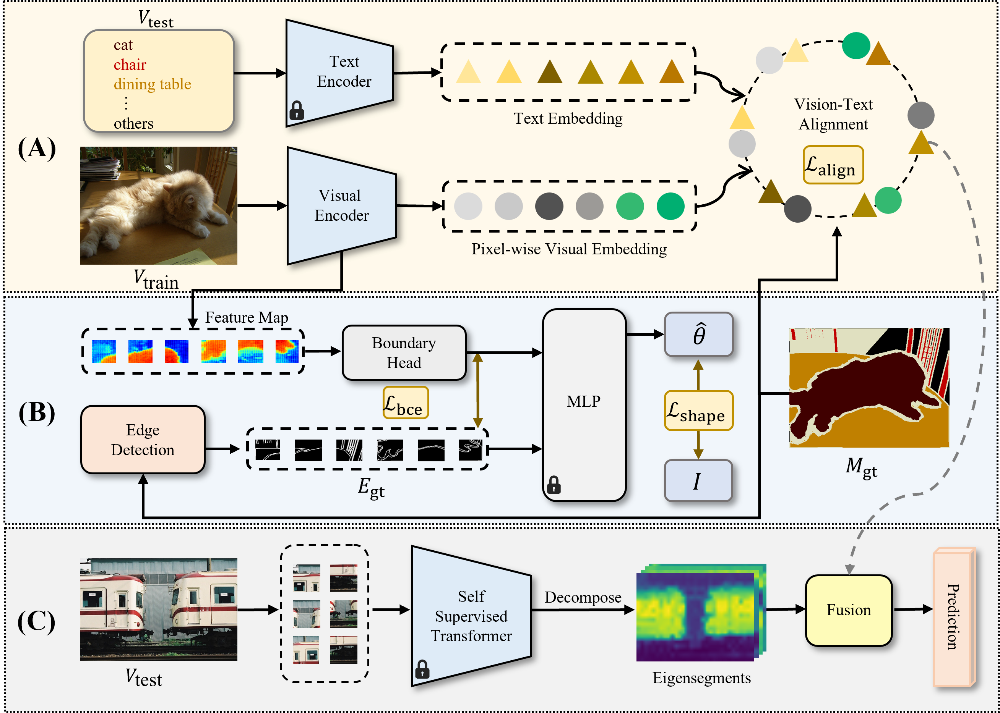

# Delving into Shape-aware Zero-shot Semantic Segmentation


Paper Accepted to CVPR 2023.




Thanks to the impressive progress of large-scale vision-language pretraining, recent recognition models can classify arbitrary objects in a zero-shot and open-set manner,with a surprisingly high accuracy. However, translating this success to semantic segmentation is not trivial, because this dense prediction task requires not only accurate semantic understanding but also fine shape delineation and existing vision-language models are trained with image-level language descriptions. To bridge this gap, we pursue shape-aware zero-shot semantic segmentation in this study. Inspired by classical spectral methods in the image segmentation literature, we propose to leverage the eigenvectors of Laplacian matrices constructed with self-supervised pixel-wise features to promote shape-awareness. Despite that this simple and effective technique does not make use of the masks of seen classes at all, we demonstrate that it outperforms a state-of-the-art shape-aware formulation that aligns ground truth and predicted edges during training. We also delve into the performance gains achieved on different datasets using different backbones and draw several interesting and conclusive observations: the benefits of promoting shape-awareness highly relates to mask compactness and language embedding locality. Finally, our method sets new state-of-the-art performance for zero-shot semantic segmentation on both Pascal and COCO, with significant margins. 
   
## Installation

### Requirements
torch==1.7.1

torchvision==0.8.2 

timm==0.4.12

opencv-python==4.1.1


### Data preparation
Download the PASCAL-5<sup>i</sup> and COCO-20<sup>i</sup> datasets following  [HERE](https://github.com/juhongm999/hsnet).  


The ./datasets/ folder should have the following hierarchy:


    └── datasets/
        ├── VOC2012/            # PASCAL VOC2012 devkit
        │   ├── Annotations/
        │   ├── ImageSets/
        │   ├── ...
        │   ├── SegmentationClassAug/
        │   └── pascal_k5/
        ├── COCO2014/           
        │   ├── annotations/
        │   │   ├── train2014/  # (dir.) training masks
        │   │   ├── val2014/    # (dir.) validation masks 
        │   │   └── ..some json files..
        │   ├── train2014/
        │   ├── val2014/
        │   └── coco_k5/
        

#### Eigenvector 
Download the top K=5 eigenvectors of the Laplacian matrix of image features from [HERE](https://drive.google.com/file/d/1VOsj2E4hfCcfISC71A08xc4mil0iJ-lq/view?usp=sharing). Unzip it directly and merge them with the current ./datasets/pascal_k5/  and  ./datasets/coco_k5/ folder

## Training and evaluating

#### Training 
#####PASCAL-5<sup>i</sup>
> ```bash
>CUDA_VISIBLE_DEVICES=0,1,2,3  python pascal_vit.py train
>                --arch vitl16_384
>                --fold {0, 1, 2, 3}  --batch_size 6
>                --random-scale 2 --random-rotate 10 
>                --lr 0.001  --drate 0.95 --lr-mode poly
>                --benchmark pascal
>```
##### COCO-20<sup>i</sup> 
> ```bash           
>CUDA_VISIBLE_DEVICES=0,1,2,3  python coco_vit.py train
>                --arch vitl16_384
>                --fold {0, 1, 2, 3}  --batch_size 6
>                --random-scale 2 --random-rotate 10 
>                --lr 0.0002 --drate 0.95  --lr-mode poly
>                --benchmark coco
>```

#### Evaluating

 To test the trained model with its checkpoint:

#####PASCAL-5<sup>i</sup>
> ```bash 
>CUDA_VISIBLE_DEVICES=0  python pascal_vit.py test
>                --arch vitl16_384
>                --fold {0, 1, 2, 3}  --batch_size 1 
>                --benchmark pascal
>                --eig_dir ./datasets/VOC2012/pascal_k5/
>                --resume "path_to_trained_model/best_model.pt"
>```
##### COCO-20<sup>i</sup> 
> ```bash 
>CUDA_VISIBLE_DEVICES=0  python coco_vit.py test
>                --arch vitl16_384
>                --fold {0, 1, 2, 3}  --batch_size 1 
>                --benchmark coco
>                --eig_dir ./datasets/COCO2014/coco_k5/
>                --resume "path_to_trained_model/best_model.pt"
>```


## Pretrained model
You can download our corresponding pre-trained models as follows:. 

##### PASCAL-5<sup>i</sup>
<table>
  <thead>
    <tr style="text-align: right;">
       <th>Dataset</th>
      <th>Fold</th>
      <th>Backbone</th>
      <th>Text Encoder</th>
      <th>mIoU</th>
      <th>URL</th>
    </tr>
  </thead>
  <tbody>
    <tr>
       <th>PASCAL</th>
       <td>0</td>
      <th>ViT-L/16</th>
      <th>ViT-B/32</th>
      <th>62.7</th>
      <td><a href="https://pan.baidu.com/s/1BNx4ONrc3eCoTSGAYGTxVg?pwd=9uey">download</a></td>
    </tr>
    <tr>
       <th>PASCAL</th>
       <td>1</td>
      <th>ViT-L/16</th>
      <th> ViT-B/32</th>
      <th>64.3</th>
      <td><a href="https://pan.baidu.com/s/1QC1JF6gcKQjOJQWXm0ZCBw?pwd=dfv8">download</a></td>
    </tr>
    <tr>
       <th>PASCAL</th>
       <td>2</td>
      <th>ViT-L/16</th>
      <th>ViT-B/32</th>
      <th>60.6</th>
      <td><a href="https://pan.baidu.com/s/1fO4HWowLW64aM3ypV2r1tA?pwd=iji7">download</a></td>
    </tr>
    <tr>
       <th>PASCAL</th>
       <td>3</td>
      <th>ViT-L/16</th>
      <th> ViT-B/32</th>
      <th>50.2</th>
      <td><a href="https://pan.baidu.com/s/1FBHoNRKWbPOFoYdHTn3UAg?pwd=f59i">download</a></td>
  </tbody>
</table>

##### COCO-20<sup>i</sup> 
<table>
  <thead>
    <tr style="text-align: right;">
       <th>Dataset</th>
      <th>Fold</th>
      <th>Backbone</th>
      <th>Text Encoder</th>
      <th>mIoU</th>
      <th>URL</th>
    </tr>
  </thead>
  <tbody>
    </tr>
    <tr>
       <th>COCO</th>
       <td>0</td>
      <th>ViT-L/16</th>
      <th>ViT-B/32</th>
      <th>33.8</th>
      <td><a href="https://pan.baidu.com/s/12ipVxYeUCONIHuVNrLSOcg?pwd=0inf">download</a></td>
    </tr>
    <tr>
       <th>COCO</th>
       <td>1</td>
      <th>ViT-L/16</th>
      <th>ViT-B/32</th>
      <th>38.1</th>
      <td><a href="https://pan.baidu.com/s/14hN50E-JeMiCf4BM3TG0ng?pwd=83q1">download</a></td>
    </tr>
    <tr>
       <th>COCO</th>
       <td>2</td>
      <th>ViT-L/16</th>
      <th>ViT-B/32</th>
      <th>34.4</th>
      <td><a href="https://pan.baidu.com/s/17UceK2X55nRldbdf6bzz1g?pwd=dxjp">download</a></td>
    </tr>
    <tr>
       <th>COCO</th>
       <td>3</td>
      <th>ViT-L/16</th>
      <th>ViT-B/32</th>
      <th>35.0</th>
      <td><a href="https://pan.baidu.com/s/1R4BtG3Hcy30Vi0oNSaLzLg?pwd=b2r0">download</a></td>
      </tbody>
</table>

<table>
  <thead>
    <tr style="text-align: right;">
       <th>Dataset</th>
      <th>Fold</th>
      <th>Backbone</th>
      <th>Text Encoder</th>
      <th>mIoU</th>
      <th>URL</th>
    </tr>
  </thead>
  <tbody>
    </tr>
    <tr>
       <th>COCO</th>
       <td>0</td>
      <th>DRN</th>
      <th>ViT-B/32</th>
      <th>34.2</th>
      <td><a href="https://pan.baidu.com/s/1MUeYzHsY7l5jeXNA2HWlQw?pwd=z531">download</a></td>
    </tr>
    <tr>
       <th>COCO</th>
       <td>1</td>
      <th>DRN</th>
      <th>ViT-B/32</th>
      <th>36.5</th>
      <td><a href="https://pan.baidu.com/s/1CEGnwy79dT5AxVpfdt2n2g?pwd=hjcw">download</a></td>
    </tr>
    <tr>
       <th>COCO</th>
       <td>2</td>
      <th>DRN</th>
      <th>ViT-B/32</th>
      <th>34.6</th>
      <td><a href="https://pan.baidu.com/s/10TSDLmy2N-Qrhl9GMS7M7w?pwd=kghz">download</a></td>
    </tr>
    <tr>
       <th>COCO</th>
       <td>3</td>
      <th>DRN</th>
      <th>ViT-B/32</th>
      <th>35.6</th>
      <td><a href="https://pan.baidu.com/s/1AVjTMW4aM1s0qBblH16RDA?pwd=60uo">download</a></td>
      </tbody>
</table>


